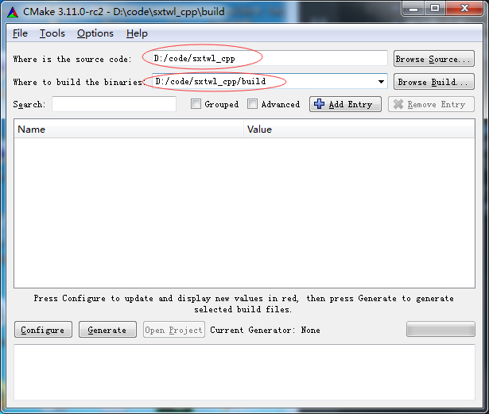
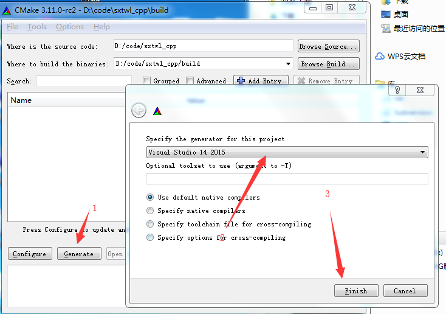
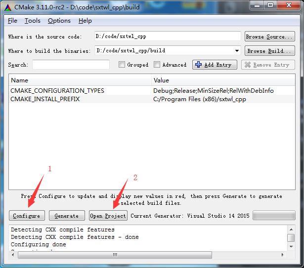
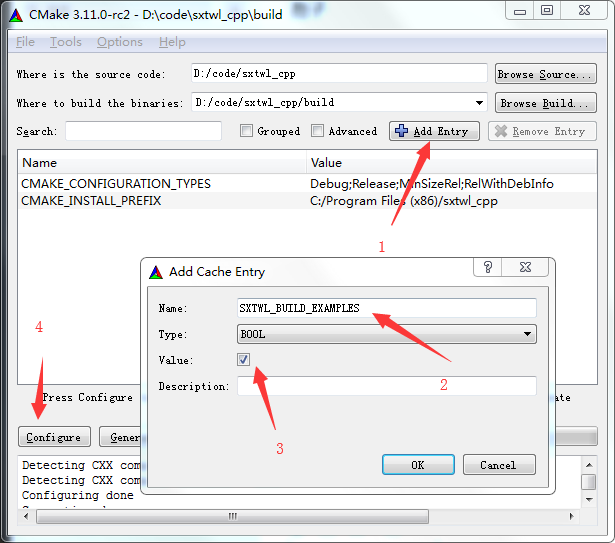

本工程使用cmake做为项目管理，以utf8做为代码格式（所以在window上，vs2015以下的版本编译前，先要做格式转换）.

### 基本环境:
* cmake下载地址(必选)：https://cmake.org/download/
* 编译器(必选): vs,g++,clang等支持c++11编译器即可
* git(可选):https://git-scm.com/
* swig下载地址(可选，如需要绑定至脚本语言时需要):  http://www.swig.org/download.html

### windows平台构建方法
1. 使用git将下载本工程代码(如果这步不会，也可以直接下载zip代码：https://github.com/yuangu/sxtwl_cpp/archive/master.zip)
git clone https://github.com/yuangu/sxtwl_cpp.git

2. 打开cmake，在"where is ths source code"里写上您刚刚下载的代码目录。在“where to build the binaries”填上编译目录（我一般是在代码目录里加一个build子目录）。如图所示:

3. 点击左下角的 "Generate" 按钮（1），弹出一个对话框。选择您的IDE（这里选择的是VS2015）（2），按Finish关闭弹窗(3)，如图所示:

4. 依次点击旁边的 "Configure"按钮 及 "Open Project"按钮(至此，您的可以编译出一个lib库出来了)，如图所示:

5. 如需要编译例子的话，您只需要增加一个参数即可。点击率 “Add Entry”按钮（1），在弹窗里的Name中输入 "SXTWL_BUILD_EXAMPLES"(2),勾选Value值（3）.按OK关闭弹窗，再点击"Configure"按钮，如图所示:

6. 如果将接口导出给python使用。请先安装swig，并将swig设置到系统的PATH环境变量里。然后按照步骤5的方法。增加一个SXTWL_WRAPPER_PYTHON的参数

### mac平台构建方法

可同windows平台构建方法，也可以用命令行:

cd ~/code/sxtwl_cpp
mkdir build
cd build
cmake .. -G "Unix Makefiles" -DSXTWL_BUILD_EXAMPLES=1
make

### linux平台构建方法
可同windows平台构建方法，也可以用命令行:

cd ~/code/sxtwl_cpp
mkdir build
cd build
cmake .. -G "Unix Makefiles" -DSXTWL_BUILD_EXAMPLES=1
make

###android平台构建方法